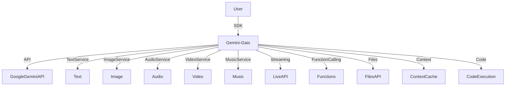

# Gemini-Gaio: The All-in-One Gemini SDK 🚀

[](https://www.npmjs.com/package/gemini-gaio)
[](LICENSE)
[](tsconfig.json)

> **Unleash the full power of Google Gemini with one SDK.**
> 
> **Text, images, audio, video, music, code, streaming, and more—modular, type-safe, and fun.**

---

## ✨ Why Gemini-Gaio?

- **All-in-One**: Every Gemini API feature in one package—text, image, audio, video, TTS, music, streaming, function calling, context, files, code execution, and more.
- **Type-Safe & Modern**: Built with strict TypeScript for maximum safety and autocompletion.
- **Production-Ready**: Robust error handling, logging, and modular design.
- **Real-World Proven**: Used in production for multimodal, agentic, and creative AI apps.
- **Easy to Use**: Simple, consistent APIs for every Gemini capability.
- **Fun & Creative**: Designed for hackers, artists, educators, and AI dreamers.

---

## 👩‍💻 Who is this for?
- AI engineers & ML researchers
- Creative coders & indie hackers
- Educators & students
- Startups & product teams
- Hackathon warriors
- Anyone who wants to build with Gemini's full multimodal power!

---

## 🎨 What can you build?
- **AI tutors** that reason, explain, and code
- **Music bots** that jam in real time
- **Video narrators** that turn text or images into movies
- **Multimodal chatbots** that see, hear, and speak
- **Document analyzers** for contracts, PDFs, and more
- **Voice assistants** with TTS and streaming
- **Creative apps**: meme generators, art critics, podcast summarizers, and more!

---

## 🏗️ How it works



---

## 🛠️ Features
- **Text, Image, Audio, Video, and Document Understanding**
- **Structured Output (JSON, Enum, Schema)**
- **Veo Video Generation (Text-to-Video, Image-to-Video)**
- **Text-to-Speech (TTS, Multi-Speaker)**
- **Lyria RealTime Music Generation**
- **Live API (Real-Time Streaming, Bidirectional)**
- **URL Context & Google Search Grounding**
- **Context Caching**
- **File Management (Upload, List, Delete)**
- **Token Counting & Usage Metadata**
- **Function Calling (OpenAPI subset, Parallel)**
- **Chain-of-Thought & Reasoning**
- **Python Code Execution (with output parsing)**
- **Strict TypeScript Types & Autocompletion**

---

## 🚀 Installation

```bash
npm install @google/genai gemini-gaio
```

---

## ⚡ Quick Start

```ts
import { TextService, GeminiModel } from 'gemini-gaio';

const text = new TextService(process.env.GEMINI_API_KEY!);
const result = await text.generateText({
  model: GeminiModel.GEMINI_2_5_PRO_PREVIEW_05_06,
  contents: 'Write a poem about AI.'
});
console.log(result.text);
```

---

## 🧑‍🔬 Usage Examples

### Multimodal Chaining
```ts
import { ImageService, GeminiModel } from 'gemini-gaio';
const image = new ImageService(process.env.GEMINI_API_KEY!);
const multimodal = [
  { text: 'Describe this image and the sound:' },
  { inlineData: { mimeType: 'image/png', data: base64Img } },
  { inlineData: { mimeType: 'audio/mp3', data: base64Audio } }
];
const result = await image.generateImage({
  model: GeminiModel.GEMINI_2_0_FLASH_PREVIEW_IMAGE_GENERATION,
  contents: multimodal
});
```

### Real-Time Streaming
```ts
import { LiveApiService, GeminiModel } from 'gemini-gaio';
const live = new LiveApiService(process.env.GEMINI_API_KEY!);
const session = await live.connectSession({
  model: GeminiModel.GEMINI_2_0_FLASH_LIVE_001,
  responseModality: 'TEXT',
  callbacks: { onmessage: (msg) => console.log(msg) }
});
await live.sendText(session, 'Hello!');
await live.closeSession(session);
```

### Function Calling
```ts
import { FunctionCallingService, GeminiModel } from 'gemini-gaio';
const fc = new FunctionCallingService(process.env.GEMINI_API_KEY!);
const fnDecl = FunctionCallingService.createFunctionDeclaration({
  name: 'getWeather',
  description: 'Get weather by city',
  parameters: { type: 'object', properties: { city: { type: 'string' } }, required: ['city'] }
});
const resp = await fc.callWithFunctions({
  model: GeminiModel.GEMINI_2_5_PRO_PREVIEW_05_06,
  contents: 'What is the weather in Paris?',
  functionDeclarations: [fnDecl]
});
```

### Advanced: Chaining, Streaming, and Error Handling
```ts
import { TextService, AudioService, Logger } from 'gemini-gaio';
Logger.enabled = true;

async function narrateAndSpeak(textPrompt: string) {
  try {
    const textService = new TextService(process.env.GEMINI_API_KEY!);
    const audioService = new AudioService(process.env.GEMINI_API_KEY!);
    const narration = await textService.generateText({
      model: 'gemini-2.5-pro-preview-05-06',
      contents: textPrompt
    });
    const audio = await audioService.generateSingleSpeakerSpeech({
      model: 'gemini-2.5-flash-preview-tts',
      text: narration.text,
      voiceName: 'Kore'
    });
    // ...play or save audio Buffer
  } catch (err) {
    Logger.error('Narration failed:', err);
  }
}
```

---

## 🧩 API Overview

All services are available from the main entry point:

```ts
import {
  TextService, ImageService, DocumentService, AudioService, VideoService,
  StructuredOutputService, VeoVideoService, TextToSpeechService, LyriaMusicService,
  LiveApiService, UrlContextService, ContextCacheService, FilesApiService,
  TokenService, FunctionCallingService, GroundingService, ThinkingService,
  CodeExecutionService, GeminiModel, Logger
} from 'gemini-gaio';
```

See the [full API documentation](https://github.com/bantoinese83/gemini-gaio-sdk) for detailed usage of each service.

---

## 🧑‍🏫 Best Practices
- **API Key Management**: Use environment variables, never hardcode keys.
- **Streaming**: Use streaming APIs for low-latency, real-time UX.
- **Error Handling**: Catch and log errors with the built-in Logger. Use try/catch in async flows.
- **Prompt Design**: Be explicit and clear in prompts for best results.
- **Large Files**: Use the File API for files >20MB.
- **TypeScript**: Leverage strict types for safety and autocompletion.
- **Testing**: Mock Gemini services for unit tests.

---

## 🧠 Technical Details
- **Strict TypeScript**: All services and types are fully typed.
- **Error Handling**: Custom error classes for API, validation, and file errors.
- **Extensible**: Add your own services or extend existing ones.
- **Modular**: Import only what you need.
- **Performance**: Uses async/await, streaming, and efficient batching where possible.

---

## ❓ FAQ

**Q: Can I use this with Next.js, Vercel, or serverless?**
A: Yes! All services are pure TypeScript/Node and work in any modern JS runtime (Node 18+, serverless, etc).

**Q: How do I handle large files?**
A: Use the File API methods for files >20MB. See `FilesApiService` and `DocumentService` examples.

**Q: How do I stream audio or text?**
A: Use `LiveApiService` for real-time streaming, or the streaming methods on `TextService` and `AudioService`.

**Q: Is this safe for production?**
A: Yes! Strict typing, error handling, and logging are built in. See Best Practices above.

**Q: Can I chain multiple modalities?**
A: Absolutely! See the advanced chaining example above.

**Q: How do I contribute?**
A: Fork, branch, code, PR! See the Contributing section below.

---

## 🌟 Showcase & Inspiration
- [ ] **AI Podcast Summarizer**: Summarize and transcribe podcasts with audio + text.
- [ ] **Real-Time Music Jam Bot**: Use LyriaMusicService for collaborative music generation.
- [ ] **Video-to-Story Generator**: Turn videos into illustrated stories with VideoService + ImageService.
- [ ] **Multimodal Chatbot**: Build a bot that sees, hears, and speaks.
- [ ] **Contract Analyzer**: Bulk-analyze legal docs with DocumentService.
- [ ] **Your project here!** PR your demo or link for a shoutout.

---

## 📚 Learn More
- [Gemini API Docs](https://ai.google.dev/gemini-api/docs)
- [Gemini-Gaio GitHub](https://github.com/bantoinese83/gemini-gaio-sdk)
- [Google AI Blog](https://ai.googleblog.com/)

---

## 🤝 Contributing

Contributions, bug reports, and feature requests are welcome! Please open an issue or pull request on [GitHub](https://github.com/bantoinese83/gemini-gaio-sdk).

- Fork the repo and create your branch from `main`.
- Add/fix your feature or bug.
- Add/adjust tests if needed.
- Open a PR and describe your changes.

---

## 💬 Support & Contact

- For questions, open a [GitHub Issue](https://github.com/bantoinese83/gemini-gaio-sdk/issues)
- For commercial support or consulting, contact [Bryan Antoine](mailto:b.antoine.se@gmail.com)

---

## 📝 License
MIT 