# Gemini-Gaio: The All-in-One Gemini SDK 🚀

[](https://www.npmjs.com/package/gemini-gaio)
[](LICENSE)
[](tsconfig.json)

> **Unleash the full power of Google Gemini with one SDK.**
> 
> **Text, images, audio, video, music, code, streaming, and more—modular, type-safe, and fun.**

---

## ✨ Why Gemini-Gaio?

- **All-in-One**: Every Gemini API feature in one package—text, image, audio, video, TTS, music, streaming, function calling, context, files, code execution, and more.
- **Type-Safe & Modern**: Built with strict TypeScript for maximum safety and autocompletion.
- **Production-Ready**: Robust error handling, logging, and modular design.
- **Real-World Proven**: Used in production for multimodal, agentic, and creative AI apps.
- **Easy to Use**: Simple, consistent APIs for every Gemini capability.
- **Fun & Creative**: Designed for hackers, artists, educators, and AI dreamers.

---

## 👩‍💻 Who is this for?
- AI engineers & ML researchers
- Creative coders & indie hackers
- Educators & students
- Startups & product teams
- Hackathon warriors
- Anyone who wants to build with Gemini's full multimodal power!

---

## 🎨 What can you build?
- **AI tutors** that reason, explain, and code
- **Music bots** that jam in real time
- **Video narrators** that turn text or images into movies
- **Multimodal chatbots** that see, hear, and speak
- **Document analyzers** for contracts, PDFs, and more
- **Voice assistants** with TTS and streaming
- **Creative apps**: meme generators, art critics, podcast summarizers, and more!

---

## 🏗️ How it works

```mermaid
graph TD;
  User((User / App))
  subgraph SDK[Gemini-Gaio SDK]
    Core["Core (gemini-service.ts)"]
    Text[TextService]
    Image[ImageService]
    Audio[AudioService]
    Video[VideoService]
    Music[LyriaMusicService]
    Streaming[LiveApiService]
    TTS[TextToSpeechService]
    FunctionCalling[FunctionCallingService]
    Files[FilesApiService]
    Context[ContextCacheService]
    Code[CodeExecutionService]
    Grounding[GroundingService]
    Structured[StructuredOutputService]
    UrlContext[UrlContextService]
    Veo[VeoVideoService]
    Document[DocumentService]
    Thinking[ThinkingService]
    Token[TokenService]
    Utils[Utils/Types]
    Logger[Logger/Error Handling]
  end
  GoogleAPI((Google Gemini API))

  User-->|calls|Core
  Core-->|uses|Text
  Core-->|uses|Image
  Core-->|uses|Audio
  Core-->|uses|Video
  Core-->|uses|Music
  Core-->|uses|Streaming
  Core-->|uses|TTS
  Core-->|uses|FunctionCalling
  Core-->|uses|Files
  Core-->|uses|Context
  Core-->|uses|Code
  Core-->|uses|Grounding
  Core-->|uses|Structured
  Core-->|uses|UrlContext
  Core-->|uses|Veo
  Core-->|uses|Document
  Core-->|uses|Thinking
  Core-->|uses|Token
  Core-->|uses|Utils
  Core-->|uses|Logger

  Text-->|API|GoogleAPI
  Image-->|API|GoogleAPI
  Audio-->|API|GoogleAPI
  Video-->|API|GoogleAPI
  Music-->|API|GoogleAPI
  Streaming-->|API|GoogleAPI
  TTS-->|API|GoogleAPI
  FunctionCalling-->|API|GoogleAPI
  Files-->|API|GoogleAPI
  Context-->|API|GoogleAPI
  Code-->|API|GoogleAPI
  Grounding-->|API|GoogleAPI
  Structured-->|API|GoogleAPI
  UrlContext-->|API|GoogleAPI
  Veo-->|API|GoogleAPI
  Document-->|API|GoogleAPI
  Thinking-->|API|GoogleAPI
  Token-->|API|GoogleAPI

  subgraph Internals
    Utils
    Logger
  end
  Core-->|uses|Internals
```



---

## 🛠️ Features
- **Text, Image, Audio, Video, and Document Understanding**
- **Structured Output (JSON, Enum, Schema)**
- **Veo Video Generation (Text-to-Video, Image-to-Video)**
- **Text-to-Speech (TTS, Multi-Speaker)**
- **Lyria RealTime Music Generation**
- **Live API (Real-Time Streaming, Bidirectional)**
- **URL Context & Google Search Grounding**
- **Context Caching**
- **File Management (Upload, List, Delete)**
- **Token Counting & Usage Metadata**
- **Function Calling (OpenAPI subset, Parallel)**
- **Chain-of-Thought & Reasoning**
- **Python Code Execution (with output parsing)**
- **Strict TypeScript Types & Autocompletion**

---

## 🚀 Installation

```bash
npm install gemini-gaio
```

---

## ⚡ Quick Start

```ts
import { TextService, GeminiModel } from 'gemini-gaio';

const text = new TextService(process.env.GEMINI_API_KEY!);
const result = await text.generateText({
  model: GeminiModel.GEMINI_2_5_PRO_PREVIEW_05_06,
  contents: 'Write a poem about AI.'
});
console.log(result.text);
```

---

## 🧑‍🔬 Usage Examples

### Multimodal Chaining
```ts
import { ImageService, GeminiModel } from 'gemini-gaio';
const image = new ImageService(process.env.GEMINI_API_KEY!);
const multimodal = [
  { text: 'Describe this image and the sound:' },
  { inlineData: { mimeType: 'image/png', data: base64Img } },
  { inlineData: { mimeType: 'audio/mp3', data: base64Audio } }
];
const result = await image.generateImage({
  model: GeminiModel.GEMINI_2_0_FLASH_PREVIEW_IMAGE_GENERATION,
  contents: multimodal
});
```

### Real-Time Streaming
```ts
import { LiveApiService, GeminiModel } from 'gemini-gaio';
const live = new LiveApiService(process.env.GEMINI_API_KEY!);
const session = await live.connectSession({
  model: GeminiModel.GEMINI_2_0_FLASH_LIVE_001,
  responseModality: 'TEXT',
  callbacks: { onmessage: (msg) => console.log(msg) }
});
await live.sendText(session, 'Hello!');
await live.closeSession(session);
```

### Function Calling
```ts
import { FunctionCallingService, GeminiModel } from 'gemini-gaio';
const fc = new FunctionCallingService(process.env.GEMINI_API_KEY!);
const fnDecl = FunctionCallingService.createFunctionDeclaration({
  name: 'getWeather',
  description: 'Get weather by city',
  parameters: { type: 'object', properties: { city: { type: 'string' } }, required: ['city'] }
});
const resp = await fc.callWithFunctions({
  model: GeminiModel.GEMINI_2_5_PRO_PREVIEW_05_06,
  contents: 'What is the weather in Paris?',
  functionDeclarations: [fnDecl]
});
```

### Advanced: Chaining, Streaming, and Error Handling
```ts
import { TextService, AudioService, Logger } from 'gemini-gaio';
Logger.enabled = true;

async function narrateAndSpeak(textPrompt: string) {
  try {
    const textService = new TextService(process.env.GEMINI_API_KEY!);
    const audioService = new AudioService(process.env.GEMINI_API_KEY!);
    const narration = await textService.generateText({
      model: 'gemini-2.5-pro-preview-05-06',
      contents: textPrompt
    });
    const audio = await audioService.generateSingleSpeakerSpeech({
      model: 'gemini-2.5-flash-preview-tts',
      text: narration.text,
      voiceName: 'Kore'
    });
    // ...play or save audio Buffer
  } catch (err) {
    Logger.error('Narration failed:', err);
  }
}
```

---

## 🧩 API Overview

All services are available from the main entry point:

```ts
import {
  TextService, ImageService, DocumentService, AudioService, VideoService,
  StructuredOutputService, VeoVideoService, TextToSpeechService, LyriaMusicService,
  LiveApiService, UrlContextService, ContextCacheService, FilesApiService,
  TokenService, FunctionCallingService, GroundingService, ThinkingService,
  CodeExecutionService, GeminiModel, Logger
} from 'gemini-gaio';
```

See the [full API documentation](https://github.com/bantoinese83/gemini-gaio-sdk) for detailed usage of each service.

## Service Usage Examples

### TextService
```ts
import { TextService, GeminiModel } from 'gemini-gaio';
const text = new TextService(process.env.GEMINI_API_KEY!);

// Basic text generation
const result = await text.generateText({
  model: GeminiModel.GEMINI_2_5_PRO_PREVIEW_05_06,
  contents: 'Write a poem about AI.'
});
console.log(result.text);

// Streaming text
for await (const chunk of await text.generateTextStream({
  model: GeminiModel.GEMINI_2_5_PRO_PREVIEW_05_06,
  contents: 'Stream a story, one sentence at a time.'
})) {
  console.log(chunk.text);
}

// Multi-turn chat
const chat = text.createChat(GeminiModel.GEMINI_2_5_PRO_PREVIEW_05_06);
const reply = await chat.sendMessage({ message: 'Hello, who are you?' });
console.log(reply.text);
```

### ImageService
```ts
import { ImageService, GeminiModel } from 'gemini-gaio';
const image = new ImageService(process.env.GEMINI_API_KEY!);

const multimodal = [
  { text: 'Describe this image:' },
  { inlineData: { mimeType: 'image/png', data: base64Img } }
];
const result = await image.generateImage({
  model: GeminiModel.GEMINI_2_0_FLASH_PREVIEW_IMAGE_GENERATION,
  contents: multimodal
});
result.forEach(part => {
  if (part.type === 'image') {
    // Save or display image (base64)
  } else {
    console.log(part.data);
  }
});
```

### AudioService
```ts
import { AudioService, GeminiModel } from 'gemini-gaio';
const audio = new AudioService(process.env.GEMINI_API_KEY!);

// Text-to-speech (single speaker)
const tts = await audio.generateSingleSpeakerSpeech({
  model: GeminiModel.GEMINI_2_5_FLASH_PREVIEW_TTS,
  text: 'Hello world',
  voiceName: 'Kore'
});
// ...play or save tts Buffer...

// Audio file analysis (transcription)
const transcript = await audio.analyzeAudioFile({
  model: GeminiModel.GEMINI_2_5_PRO_PREVIEW_05_06,
  filePath: './audio.mp3',
  prompt: 'Transcribe this audio.'
});
console.log(transcript);

// Count tokens in audio
const tokens = await audio.countAudioTokens({
  model: GeminiModel.GEMINI_2_5_PRO_PREVIEW_05_06,
  filePath: './audio.mp3'
});
console.log(tokens);
```

### VideoService
```ts
import { VideoService, GeminiModel } from 'gemini-gaio';
const video = new VideoService(process.env.GEMINI_API_KEY!);

// Analyze a local video file
const summary = await video.analyzeVideoFile({
  model: GeminiModel.GEMINI_2_5_PRO_PREVIEW_05_06,
  filePath: './video.mp4',
  prompt: 'Summarize this video.'
});
console.log(summary);

// Analyze a YouTube video
const ytSummary = await video.analyzeYoutubeVideo({
  model: GeminiModel.GEMINI_2_5_PRO_PREVIEW_05_06,
  youtubeUrl: 'https://youtube.com/xyz',
  prompt: 'Summarize this YouTube video.'
});
console.log(ytSummary);
```

### DocumentService
```ts
import { DocumentService, GeminiModel } from 'gemini-gaio';
const doc = new DocumentService(process.env.GEMINI_API_KEY!);

// Summarize a PDF from a URL
const summary = await doc.summarizeFromUrl({
  model: GeminiModel.GEMINI_2_5_PRO_PREVIEW_05_06,
  url: 'https://example.com/file.pdf'
});
console.log(summary);

// Summarize a large local PDF
const summaryLarge = await doc.summarizeLargeFromFile({
  model: GeminiModel.GEMINI_2_5_PRO_PREVIEW_05_06,
  filePath: './file.pdf'
});
console.log(summaryLarge);

// Summarize multiple documents
const multi = await doc.summarizeMultiple({
  model: GeminiModel.GEMINI_2_5_PRO_PREVIEW_05_06,
  docs: [
    { file: './file1.pdf', displayName: 'Doc1' },
    { file: 'https://example.com/file2.pdf', displayName: 'Doc2', isUrl: true }
  ],
  prompt: 'Summarize all docs'
});
console.log(multi);
```

### FilesApiService
```ts
import { FilesApiService } from 'gemini-gaio';
const files = new FilesApiService(process.env.GEMINI_API_KEY!);

// Upload a file
const uploaded = await files.uploadFile({ file: './file.pdf', mimeType: 'application/pdf' });
console.log(uploaded);

// List files
const listed = await files.listFiles();
console.log(listed);

// Get file metadata
const fileMeta = await files.getFile(uploaded.name);
console.log(fileMeta);

// Delete a file
await files.deleteFile(uploaded.name);
```

### FunctionCallingService
```ts
import { FunctionCallingService, GeminiModel } from 'gemini-gaio';
const fc = new FunctionCallingService(process.env.GEMINI_API_KEY!);

const fnDecl = FunctionCallingService.createFunctionDeclaration({
  name: 'getWeather',
  description: 'Get weather by city',
  parameters: { type: 'object', properties: { city: { type: 'string' } }, required: ['city'] }
});

const resp = await fc.callWithFunctions({
  model: GeminiModel.GEMINI_2_5_PRO_PREVIEW_05_06,
  contents: 'What is the weather in Paris?',
  functionDeclarations: [fnDecl]
});
console.log(resp);

// Parallel function calling
const respParallel = await fc.callWithParallelFunctions({
  model: GeminiModel.GEMINI_2_5_PRO_PREVIEW_05_06,
  contents: 'Get weather and news for Paris.',
  functionDeclarations: [fnDecl /*, ...other functions */]
});
console.log(respParallel);
```

### CodeExecutionService
```ts
import { CodeExecutionService, GeminiModel } from 'gemini-gaio';
const codeExec = new CodeExecutionService(process.env.GEMINI_API_KEY!);

// Single-turn code execution (Python)
const parts = await codeExec.executeCode({
  model: GeminiModel.GEMINI_2_0_FLASH,
  prompt: 'Calculate the sum of the first 50 prime numbers in Python.'
});
console.log(parts);

// Chat-based code execution
const chatHistory = [
  { role: 'user', parts: [{ text: 'I have a math question for you:' }] },
  { role: 'model', parts: [{ text: "Great! I'm ready for your math question." }] },
];
const chatParts = await codeExec.executeCodeChat({
  model: GeminiModel.GEMINI_2_0_FLASH,
  history: chatHistory,
  message: 'What is the sum of the first 50 prime numbers?'
});
console.log(chatParts);
```

### StructuredOutputService
```ts
import { StructuredOutputService, GeminiModel } from 'gemini-gaio';
const struct = new StructuredOutputService(process.env.GEMINI_API_KEY!);

const schema = { type: 'object', properties: { name: { type: 'string' } }, required: ['name'] };
const result = await struct.generateStructuredOutput({
  model: GeminiModel.GEMINI_2_5_PRO_PREVIEW_05_06,
  contents: 'Extract the name.',
  config: { responseMimeType: 'application/json', responseSchema: schema }
});
console.log(result);
```

### VeoVideoService
```ts
import { VeoVideoService, GeminiModel } from 'gemini-gaio';
const veo = new VeoVideoService(process.env.GEMINI_API_KEY!);

// Generate video from text
const uris = await veo.generateVideoFromText({ prompt: 'A cat playing piano.', model: GeminiModel.VEO_2_0_GENERATE_001 });
console.log(uris);

// Download the video
await veo.downloadVideo(uris[0], 'cat.mp4');
```

### TextToSpeechService
```ts
import { TextToSpeechService, GeminiModel } from 'gemini-gaio';
const tts = new TextToSpeechService(process.env.GEMINI_API_KEY!);

// Single-speaker TTS
const audioBuffer = await tts.generateSingleSpeakerSpeech({
  model: GeminiModel.GEMINI_2_5_FLASH_PREVIEW_TTS,
  text: 'Hello world',
  voiceName: 'Kore'
});

// Multi-speaker TTS
const audioMulti = await tts.generateMultiSpeakerSpeech({
  model: GeminiModel.GEMINI_2_5_PRO_PREVIEW_TTS,
  text: 'Amit: नमस्ते! John: Hello!',
  speakers: [
    { speaker: 'Amit', voiceName: 'Sadaltager' },
    { speaker: 'John', voiceName: 'Kore' },
  ],
});
```

### LyriaMusicService
```ts
import { LyriaMusicService } from 'gemini-gaio';
const lyria = new LyriaMusicService(process.env.GEMINI_API_KEY!);

const session = lyria.connectSession({
  onMessage: (msg) => { /* handle PCM audio */ }
});
await lyria.setWeightedPrompts(session, [{ text: 'jazz', weight: 1 }]);
await lyria.play(session);
```

### LiveApiService
```ts
import { LiveApiService, GeminiModel } from 'gemini-gaio';
const live = new LiveApiService(process.env.GEMINI_API_KEY!);

const session = await live.connectSession({
  model: GeminiModel.GEMINI_2_0_FLASH_LIVE_001,
  responseModality: 'TEXT',
  callbacks: { onmessage: (msg) => { /* handle stream */ } }
});
await live.sendText(session, 'Hello!');
await live.closeSession(session);
```

### UrlContextService
```ts
import { UrlContextService, GeminiModel } from 'gemini-gaio';
const urlCtx = new UrlContextService(process.env.GEMINI_API_KEY!);

const result = await urlCtx.generateWithUrlContext({
  model: GeminiModel.GEMINI_2_5_PRO_PREVIEW_05_06,
  contents: 'Summarize https://en.wikipedia.org/wiki/AI'
});
console.log(result);
```

### ContextCacheService
```ts
import { ContextCacheService, GeminiModel } from 'gemini-gaio';
const cache = new ContextCacheService(process.env.GEMINI_API_KEY!);

const created = await cache.createCache({
  model: GeminiModel.GEMINI_2_5_PRO_PREVIEW_05_06,
  fileUris: [{ uri: 'gs://...', mimeType: 'application/pdf' }]
});
const result = await cache.generateWithCache({
  model: GeminiModel.GEMINI_2_5_PRO_PREVIEW_05_06,
  contents: 'Use the cached doc',
  cacheName: created.name
});
console.log(result);
```

### TokenService
```ts
import { TokenService, GeminiModel } from 'gemini-gaio';
const tokens = new TokenService(process.env.GEMINI_API_KEY!);

// Count tokens in text
const count = await tokens.countTextTokens(GeminiModel.GEMINI_2_5_PRO_PREVIEW_05_06, 'How many tokens?');
console.log(count);
```

---

## 🧑‍🏫 Best Practices
- **API Key Management**: Use environment variables, never hardcode keys.
- **Streaming**: Use streaming APIs for low-latency, real-time UX.
- **Error Handling**: Catch and log errors with the built-in Logger. Use try/catch in async flows.
- **Prompt Design**: Be explicit and clear in prompts for best results.
- **Large Files**: Use the File API for files >20MB.
- **TypeScript**: Leverage strict types for safety and autocompletion.
- **Testing**: Mock Gemini services for unit tests.

---

## 🧠 Technical Details
- **Strict TypeScript**: All services and types are fully typed.
- **Error Handling**: Custom error classes for API, validation, and file errors.
- **Extensible**: Add your own services or extend existing ones.
- **Modular**: Import only what you need.
- **Performance**: Uses async/await, streaming, and efficient batching where possible.

---

## ❓ FAQ

**Q: Can I use this with Next.js, Vercel, or serverless?**
A: Yes! All services are pure TypeScript/Node and work in any modern JS runtime (Node 18+, serverless, etc).

**Q: How do I handle large files?**
A: Use the File API methods for files >20MB. See `FilesApiService` and `DocumentService` examples.

**Q: How do I stream audio or text?**
A: Use `LiveApiService` for real-time streaming, or the streaming methods on `TextService` and `AudioService`.

**Q: Is this safe for production?**
A: Yes! Strict typing, error handling, and logging are built in. See Best Practices above.

**Q: Can I chain multiple modalities?**
A: Absolutely! See the advanced chaining example above.

**Q: How do I contribute?**
A: Fork, branch, code, PR! See the Contributing section below.

---

## 🌟 Showcase & Inspiration
- [ ] **AI Podcast Summarizer**: Summarize and transcribe podcasts with audio + text.

```ts
// AI Podcast Summarizer Example
import { AudioService, DocumentService, GeminiModel } from 'gemini-gaio';
const audio = new AudioService(process.env.GEMINI_API_KEY!);
const doc = new DocumentService(process.env.GEMINI_API_KEY!);

// 1. Transcribe podcast audio
const transcript = await audio.analyzeAudioFile({
  model: GeminiModel.GEMINI_2_5_PRO_PREVIEW_05_06,
  filePath: './podcast.mp3',
  prompt: 'Transcribe this podcast episode.'
});
// 2. Summarize the transcript
const summary = await doc.summarizeFromUrl({
  model: GeminiModel.GEMINI_2_5_PRO_PREVIEW_05_06,
  url: 'data:text/plain;base64,' + Buffer.from(transcript).toString('base64')
});
console.log('Summary:', summary);
```

- [ ] **Real-Time Music Jam Bot**: Use LyriaMusicService for collaborative music generation.

```ts
// Real-Time Music Jam Bot Example
import { LyriaMusicService } from 'gemini-gaio';
const lyria = new LyriaMusicService(process.env.GEMINI_API_KEY!);

const session = lyria.connectSession({
  onMessage: (msg) => {
    // Handle PCM audio chunk (play or stream to users)
    console.log('Music chunk received', msg);
  },
  onError: (err) => console.error('Music error:', err),
  onClose: () => console.log('Session closed'),
});
await lyria.setWeightedPrompts(session, [
  { text: 'funky jazz', weight: 1 },
  { text: 'saxophone solo', weight: 0.5 }
]);
await lyria.play(session);
```

- [ ] **Video-to-Story Generator**: Turn videos into illustrated stories with VideoService + ImageService.

```ts
// Video-to-Story Generator Example
import { VideoService, ImageService, GeminiModel } from 'gemini-gaio';
const video = new VideoService(process.env.GEMINI_API_KEY!);
const image = new ImageService(process.env.GEMINI_API_KEY!);

// 1. Summarize video into story scenes
const story = await video.analyzeVideoFile({
  model: GeminiModel.GEMINI_2_5_PRO_PREVIEW_05_06,
  filePath: './movie.mp4',
  prompt: 'Break this video into 5 illustrated story scenes.'
});
// 2. Generate an image for each scene
const scenes = story.split('\n').filter(Boolean);
for (const scene of scenes) {
  const img = await image.generateImage({
    model: GeminiModel.GEMINI_2_0_FLASH_PREVIEW_IMAGE_GENERATION,
    contents: [{ text: scene }]
  });
  // Save or display img[0].data (base64)
  console.log('Scene:', scene, 'Image:', img[0].data);
}
```

- [ ] **Multimodal Chatbot**: Build a bot that sees, hears, and speaks.

```ts
// Multimodal Chatbot Example
import { TextService, AudioService, ImageService, GeminiModel } from 'gemini-gaio';
const text = new TextService(process.env.GEMINI_API_KEY!);
const audio = new AudioService(process.env.GEMINI_API_KEY!);
const image = new ImageService(process.env.GEMINI_API_KEY!);

// User sends text, image, and audio
const userInput = [
  { text: 'What is happening in this image and audio?' },
  { inlineData: { mimeType: 'image/png', data: base64Img } },
  { inlineData: { mimeType: 'audio/mp3', data: base64Audio } }
];
const response = await text.generateText({
  model: GeminiModel.GEMINI_2_5_PRO_PREVIEW_05_06,
  contents: userInput
});
console.log('Bot says:', response.text);
// Optionally, reply with TTS
const tts = await audio.generateSingleSpeakerSpeech({
  model: GeminiModel.GEMINI_2_5_FLASH_PREVIEW_TTS,
  text: response.text,
  voiceName: 'Kore'
});
// ...play tts Buffer...
```

- [ ] **Contract Analyzer**: Bulk-analyze legal docs with DocumentService.

```ts
// Contract Analyzer Example
import { DocumentService, GeminiModel } from 'gemini-gaio';
const doc = new DocumentService(process.env.GEMINI_API_KEY!);

const contracts = [
  { file: './contract1.pdf', displayName: 'Contract 1' },
  { file: './contract2.pdf', displayName: 'Contract 2' }
];
const analysis = await doc.summarizeMultiple({
  model: GeminiModel.GEMINI_2_5_PRO_PREVIEW_05_06,
  docs: contracts,
  prompt: 'Summarize the key obligations and risks in each contract.'
});
console.log('Analysis:', analysis);
```

---

## 📚 Learn More
- [Gemini API Docs](https://ai.google.dev/gemini-api/docs)
- [Gemini-Gaio GitHub](https://github.com/bantoinese83/gemini-gaio-sdk)
- [Google AI Blog](https://ai.googleblog.com/)

---

## 🤝 Contributing

Contributions, bug reports, and feature requests are welcome! Please open an issue or pull request on [GitHub](https://github.com/bantoinese83/gemini-gaio-sdk).

- Fork the repo and create your branch from `main`.
- Add/fix your feature or bug.
- Add/adjust tests if needed.
- Open a PR and describe your changes.

---

## 💬 Support & Contact

- For questions, open a [GitHub Issue](https://github.com/bantoinese83/gemini-gaio-sdk/issues)
- For commercial support or consulting, contact [Bryan Antoine](mailto:b.antoine.se@gmail.com)

---

## 📝 License
MIT 